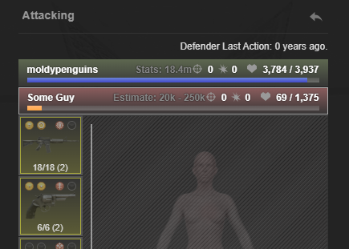
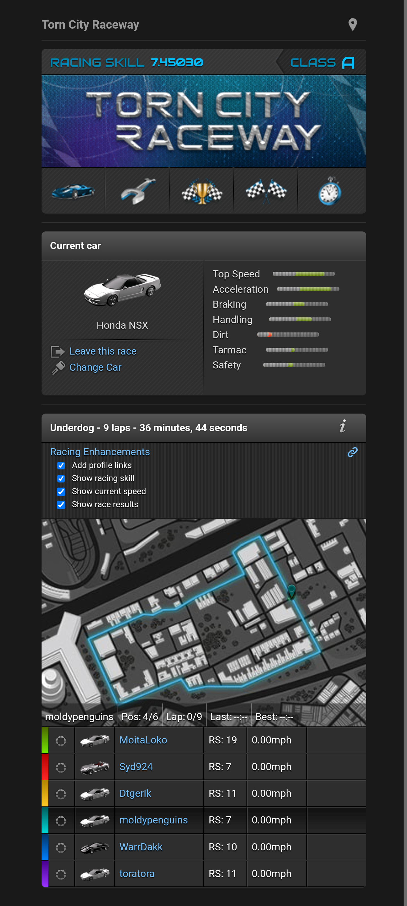
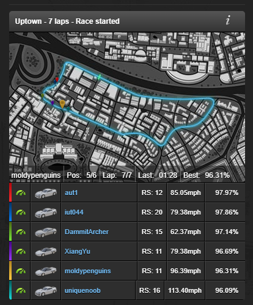
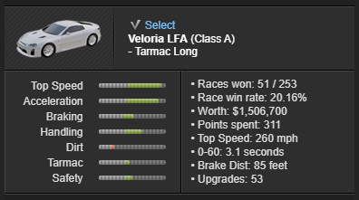
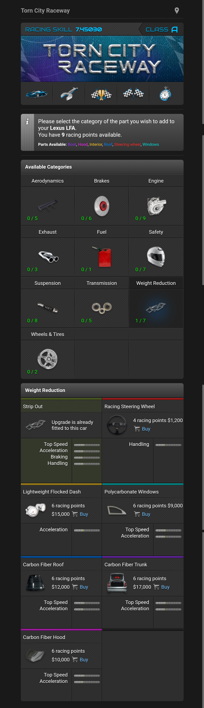
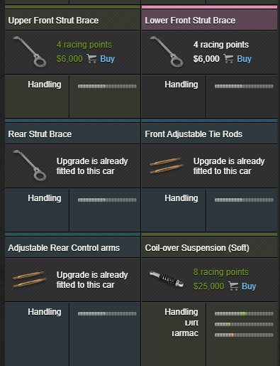
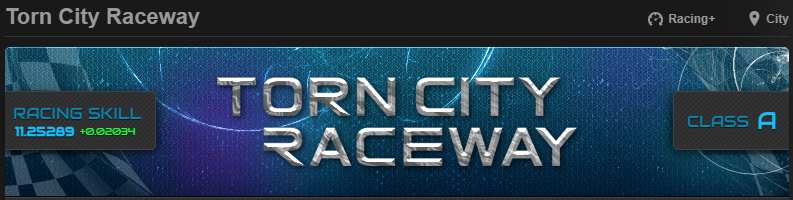

# TornPDA UserScripts

```json
TornPDA {
  ExecutePlus,
  FriendsPlus
  RacingPlus
}
```

## Execute+ v0.99.0

Show level when execute will be effective.
[Install Execute+ User Script](https://raw.githubusercontent.com/moldypenguins/TornPDA/refs/heads/main/dist/ExecutePlus.user.js)

### Screenshots



## Racing+ v0.99.49

Show racing skill, current speed, race results, precise skill, upgrade parts.
[Install RacingPlus User Script](https://raw.githubusercontent.com/moldypenguins/TornPDA/refs/heads/main/dist/RacingPlus.user.js)

### Screenshots

#### Options

* Changed menu location
* Added new options
* TornPDA: API Key can be changed from *Advanced browser settings > Manage scripts*



#### Racing

* Adjusted display



#### Enlisted

* moved total races to races won.
* changed total races to race win rate.



#### Parts

* List parts bought of total parts
* Added color coded parts available list
* Associated parts have the same color header
* Added active bought part and bought parts





#### Desktop

* Fixed top banner look


