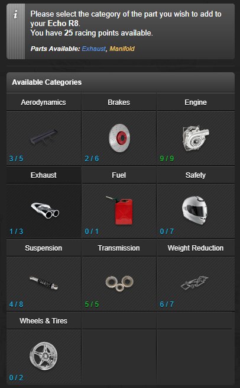

<h1>TornPDA User Scripts</h1>

<h2>Execute v0.1</h2>

Show level when execute will be effective.

<a href="https://github.com/moldypenguins/TornPDA/raw/refs/heads/main/Execute.user.js">Install Execute User Script</a>
<h3>Screenshots</h3>

<h2>Racing+ v0.1</h2>

Show racing skill, current speed, race results, precise skill, upgrade parts.

<a href="https://github.com/moldypenguins/TornPDA/raw/refs/heads/main/RacingPlus.user.js">Install RacingPlus User Script</a>
<h3>Screenshots</h3>

<h4>Desktop</h4>

