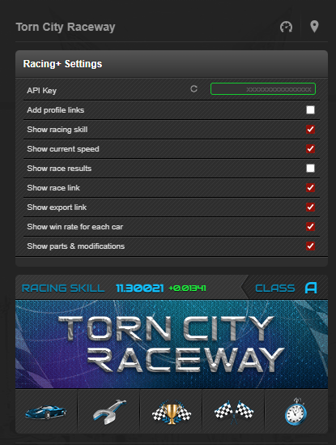

<h1>TornPDA User Scripts</h1>

<h2>racing_enhancements v0.6.2</h2>

Show racing skill, current speed, race results, precise skill, upgrade parts.

<b>NOTE:</b> racing_enhancements.pda.js requires <a target="_blank" href="https://github.com/Manuito83/torn-pda/raw/master/userscripts/GMforPDA.user.js">GMforPDA v1.0</a>

<h3>Screenshots</h3>

  <picture>
    
  </picture>
  <picture>
    
  </picture>

